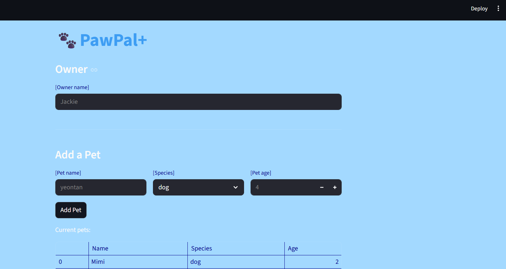

# PawPal+ (Module 2 Project)

You are building **PawPal+**, a Streamlit app that helps a pet owner plan care tasks for their pet.

## Scenario

A busy pet owner needs help staying consistent with pet care. They want an assistant that can:

- Track pet care tasks (walks, feeding, meds, enrichment, grooming, etc.)
- Consider constraints (time available, priority, owner preferences)
- Produce a daily plan and explain why it chose that plan

Your job is to design the system first (UML), then implement the logic in Python, then connect it to the Streamlit UI.

## What you will build

Your final app should:

- Let a user enter basic owner + pet info
- Let a user add/edit tasks (duration + priority at minimum)
- Generate a daily schedule/plan based on constraints and priorities
- Display the plan clearly (and ideally explain the reasoning)
- Include tests for the most important scheduling behaviors

## Features

### Owner & Pet Management

- Add an owner with a name, and register multiple pets (name, species, age) under that owner
- Remove pets from an owner's roster with automatic cleanup of bidirectional references

### Task Creation & Assignment

- Create care tasks with a description, due date, due time, priority (high / medium / low), and frequency (daily / weekly / monthly)
- Assign tasks to a specific pet; the task and pet maintain linked references to each other

### Priority-Based Schedule Sorting

- When generating a daily schedule, tasks are sorted first by priority (`high → medium → low`) and then chronologically by time within each priority tier
- Unrecognized priority values fall back to medium so the schedule never crashes

### Conflict Detection

- After sorting, the scheduler groups tasks by their exact `time_due`
- Any time slot shared by two or more tasks triggers a human-readable warning: `"Warning: conflict at {time} — {pet}: {task} | {pet}: {task}"`
- Surfaces all conflicts at once so the owner can reschedule before the day starts

### Daily & Weekly Recurrence

- Marking a task complete automatically creates the next occurrence: +1 day for `"daily"` tasks, +7 days for `"weekly"` tasks
- The follow-up task is a copy of the original with `completion_status` reset to `False` and `date_due` advanced by the correct interval
- Tasks with no assigned pet or an unsupported frequency (e.g., `"monthly"`) are completed without generating a duplicate

### Filtering

- Filter the schedule by pet name (case-insensitive) to see only one pet's tasks
- Filter by completion status to see outstanding or finished tasks
- Both filters can be combined; results are sorted by `time_due`

### Streamlit UI

- Live form for adding pets and tasks with immediate table feedback
- "Generate Schedule" button renders the full sorted schedule and displays any conflict warnings inline
- Session state keeps owner and pet data alive across UI interactions within a session

## Getting started

### Setup

```bash
python -m venv .venv
source .venv/bin/activate  # Windows: .venv\Scripts\activate
pip install -r requirements.txt
```

### Suggested workflow

1. Read the scenario carefully and identify requirements and edge cases.
2. Draft a UML diagram (classes, attributes, methods, relationships).
3. Convert UML into Python class stubs (no logic yet).
4. Implement scheduling logic in small increments.
5. Add tests to verify key behaviors.
6. Connect your logic to the Streamlit UI in `app.py`.
7. Refine UML so it matches what you actually built.

### Smarter Scheduling

Allows user to program tasks and reminders at their convenience as they carry their responsibility as pet owners. The app filters schedules by individual pet or completion status, and also detects potential time-slot conflicts across multiple pets without the instant multiple tasks are booked for the exact same time. User also promptly receives organized to-do tasks with meeting due dates and priortization.

### Testing PawPal+

**System Reliability:** ⭐⭐⭐⭐ (4/5 Stars)

Behaviors to verify:

- calendar creation when no calendar is passed into the scheduler class
- Processing existing calendar when passed to scheduler`
- verify what is returned when there is no owner record (instance) passed to scheduler
- Revise if all tasks are sorted by priority and date

#### Test Suite Overview (`test_pawpal.py`)

The test_pawpal file ensures the core scheduling logic works smoothly for the pet owner. It contains detailed tests that target potential edge-cases:

- **Task Updates:** Checks that when you mark a task as "complete," the app actually remembers it's done.
- **Recurring Chores:** Confirms that when you finish a daily or weekly task (like feeding or walking), the app automatically creates the _next_ occurrence for the correct future date
- **Pet Links:** Makes sure that when you assign a task to a pet object, that specific pet's personal to-do list is counted correctly.
- **Organizing the Day:** Verifies that when the app builds your daily schedule, it puts the most important (high-priority) tasks at the top, and then organizes the rest chronologically by time. It also ensures tasks from yesterday or tomorrow don't accidentally overlap with "today's" view.
- **Conflict Warnings:** Tests the system's ability to warn you if you accidentally schedule two different tasks for two different pets at the exact same time
- **Safe Defaults:** Ensures the app doesn't crash in weird situations, such as when a task doesn't have an assigned priority, when starting a brand new empty calendar, or when viewing a schedule that hasn't been linked to a specific user yet.

To test and verify behavior of application features, run the following command:

```bash
python -m pytest
```

## 📸 Demo

<a href="image.png" target="_blank"></a>
